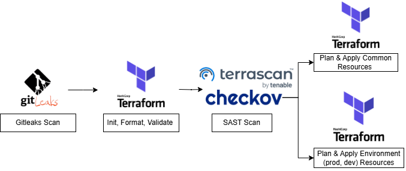
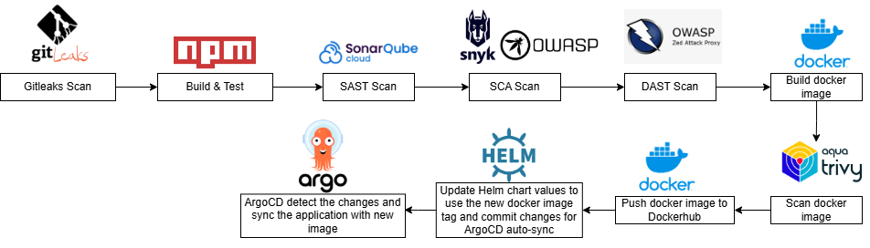
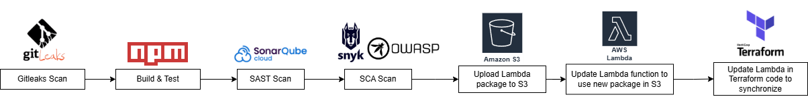
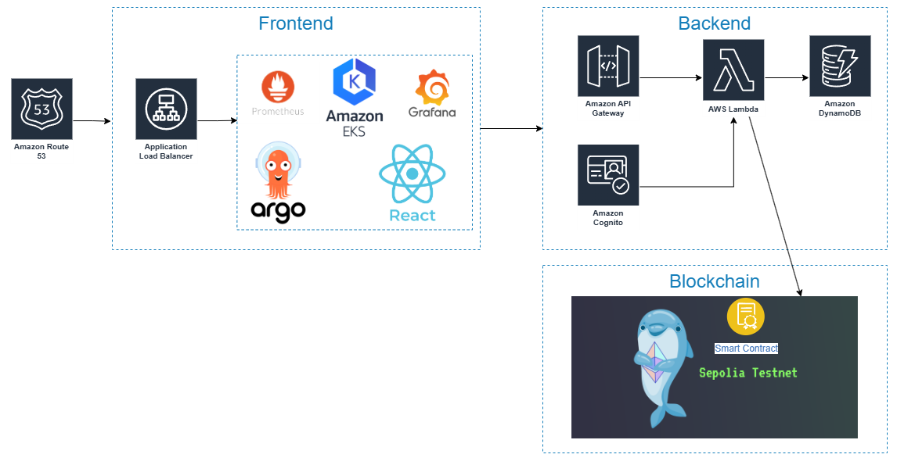

# 🔍 Hệ thống Truy xuất Nguồn gốc Sản phẩm

Hệ thống ứng dụng web giúp truy xuất nguồn gốc sản phẩm, sử dụng quy trình DevSecOps và kiến trúc hybrid kết hợp giữa serverless và microservices trên nền tảng AWS. Với việc áp dụng công nghệ Blockchain cho việc xác thực, đảm bảo tính minh bạch khi truy xuất nguồn gốc sản phẩm. Các tính năng sử dụng còn ở mức đơn giản với mục đích thử nghiệm. 

## 👥 Nhóm phát triển

- **Sinh viên**: Trần Gia Bảo - 22520120 (Nhóm trưởng, Backend developer, Cloud Infrastructure & DevSecOps Engineer)
- **Sinh viên**: Nguyễn Đặng Bình Minh - 22520871 (Blockchain, Frontend Developer)

## 🛠️ Công nghệ sử dụng

### 🎨 Frontend (Microservices)
- **⚛️ React.js** - Giao diện người dùng
- **☸️ AWS EKS** - Kubernetes cluster với 3 nodegroups
- **🌐 AWS Route53** - Quản lý DNS và tên miền
- **⚖️ AWS Load Balancer** - Cân bằng tải

### ⚡ Backend (Serverless)
- **🔧 AWS Lambda** (Node.js) - API server chính
- **🚪 API Gateway** - RESTful API endpoints
- **🗄️ DynamoDB** - Cơ sở dữ liệu NoSQL (single table design)
- **🔐 AWS Cognito** - Xác thực và phân quyền người dùng

### 🔗 Blockchain
- **⛓️ Ethereum Sepolia Testnet** - Mạng blockchain test
- **📋 Smart Contracts** - Lưu trữ bất biến dữ liệu sản phẩm
- **🌐 Web3.js + Infura** - Kết nối blockchain

### 📊 Giám sát & Monitoring
- **📈 Prometheus** - Thu thập metrics
- **📊 Grafana** - Dashboard giám sát

### 🏗️ Infrastructure as Code
- **🔧 Terraform** - Quản lý hạ tầng dưới dạng code
- **🪣 AWS S3** - Remote state backend cho Terraform
- **🔒 AWS DynamoDB** - State locking cho Terraform
- **📦 Terraform Modules** - Tái sử dụng và quản lý modules

### 🔄 DevSecOps CI/CD Pipeline
- **🔄 GitHub Actions** - Công cụ CI/CD của GitHub 
- **🚀 ArgoCD** - GitOps CD
- **⛵ Helm** - Kubernetes package manager
- **🔍 Security Tools:**
  - **🕳️ Gitleaks** - Quét secrets
  - **📊 SonarQube Cloud** - Phân tích chất lượng code và bảo mật 
  - **🔍 Snyk** - Quét lỗ hổng dependencies
  - **🛡️ OWASP ZAP** - Test ứng dụng web đang chạy
  - **🏗️ Checkov** - Quét bảo mật Infrastructure as Code
  - **🔒 Terrascan** - Quét bảo mật Infrastructure as Code
  - **🐳 Trivy** - Quét lỗ hổng container image

## 🔄 CI/CD Pipeline

### 🏗️ Cho IaC (Infrastructure as Code)

**Các giai đoạn:**
- **🔍 GitLeaks Scan** - Quét thông tin bí mật bị lộ
- **✅ Terraform Format & Validate** - Kiểm tra cú pháp và format
- **🛡️ SAST Security Scan** - Quét bảo mật với Checkov và Terrascan
- **📋 Terraform Plan** - Lập kế hoạch triển khai
- **🚀 Terraform Apply** - Triển khai infrastructure

### 🎨 Cho Frontend

**Các giai đoạn:**
- **🔍 GitLeaks Scan** - Quét secret leaks
- **🏗️ Build & Test** - Build ứng dụng React và chạy unit tests
- **🛡️ Security Scanning:**
  - **📊 SonarQube** - Phân tích chất lượng code
  - **🔍 Snyk & OWASP** - Quét lỗ hổng dependencies
  - **🌐 OWASP ZAP** - Test ứng dụng đang chạy
- **🐳 Docker Build & Trivy Scan** - Build image và quét lỗ hổng
- **📦 Push to DockerHub** - Đẩy image lên registry
- **⛵ Update Helm Values** - Cập nhật image tag trong Helm charts
- **🚀 ArgoCD Auto-sync** - Tự động triển khai qua GitOps

### ⚡ Cho Backend

**Các giai đoạn:**
- **🔍 GitLeaks Scan** - Secret scanning
- **🏗️ Build & Test** - Build và test Lambda functions
- **🛡️ Security Scans:**
  - **📊 SonarQube** - Code analysis
  - **🔍 Snyk** - Dependencies scan
  - **🕳️ OWASP** - Security vulnerabilities
- **📦 Package Lambda** - Đóng gói Lambda functions
- **🚀 Deploy to AWS** - Triển khai lên AWS Lambda

## 🏗️ IaC (Infrastructure as Code)

Sử dụng **Terraform** để triển khai cơ sở hạ tầng của hệ thống, dưới dạng modules có thể tái sử dụng với:

- **🪣 S3 Backend** - Lưu trữ tfstate từ xa
- **🔒 DynamoDB State Lock** - Khóa state để tránh xung đột
- **📦 Terraform Modules** - Tái sử dụng components
- **🌍 Multi-Environment** - Hỗ trợ dev và prod environments
- **🔄 Automated Deployment** - Tự động triển khai qua CI/CD

## 💻 Ứng dụng

### 🏛️ Kiến trúc

### 🎨 Frontend
- **⚛️ ReactJS** - Single Page Application (SPA)
- **☸️ EKS Deployment** - Triển khai trên Kubernetes cluster
- **🚀 GitOps with ArgoCD** - Tự động triển khai thông qua Git
- **⛵ Helm Charts** - Quản lý cấu hình Kubernetes
- **🌐 Route53 + Load Balancer** - Quản lý domain và cân bằng tải

### ⚡ Backend
- **🔧 AWS Lambda (Node.js)** - Serverless API functions
- **🚪 API Gateway** - RESTful endpoints
- **🔐 AWS Cognito** - Authentication & authorization
- **🗄️ DynamoDB Single Table Design** - Với Global Secondary Indexes (GSI)

### 🔗 Blockchain
- **⛓️ Ethereum Sepolia Testnet** - Blockchain test network
- **🔗 Infura API** - Blockchain connection provider
- **📋 Smart Contracts** - Immutable product registry
- **🤝 Hybrid Architecture** - Kết hợp DynamoDB và Blockchain để đảm bảo tính minh bạch và chính xác

## 🚀 Tính năng chính

### 👤 Cho Người tiêu dùng
- ✅ **🔍 Tra cứu nguồn gốc sản phẩm**
- ✅ **🔗 Xác thực trên Blockchain**
- ✅ **🚚 Xem lịch trình vận chuyển**logistics

### 🏭 Cho Nhà sản xuất
- ✅ **📝 Đăng ký sản phẩm trên Blockchain**
- ✅ **📦 Quản lý danh mục sản phẩm**
- ✅ **📤 Theo dõi đơn hàng xuất**
- ✅ **🔄 Cập nhật trạng thái sản xuất**

### 🏪 Cho Nhà bán lẻ
- ✅ **📦 Quản lý kho hàng**
- ✅ **📥📤 Theo dõi nhập/xuất**
- ✅ **💳 Xử lý đơn bán hàng**

## 📊 Giám sát
- **📈 Prometheus** - Thu thập metrics
- **📊 Grafana** - Dashboard theo dõi
- **🔍 CloudWatch** - Công cụ giám sát của AWS

## 🔐 Security Features

- **🔍 Secret Scanning** với Gitleaks
- **📊 Code Quality** với SonarQube
- **🔍 Dependency Scanning** với Snyk & OWASP
- **🏗️ Infrastructure Security** với Checkov & Terrascan
- **🐳 Container Security** với Trivy
- **🌐 Runtime Security** với OWASP ZAP

## 📄 License

Dự án này được phát triển cho mục đích học tập, phục vụ cho Đồ án chuyên ngành tại Đại học Công nghệ Thông tin - UIT.

⭐ **Star this repo if you find it helpful!**
